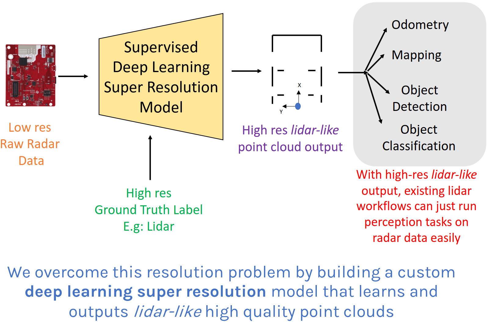
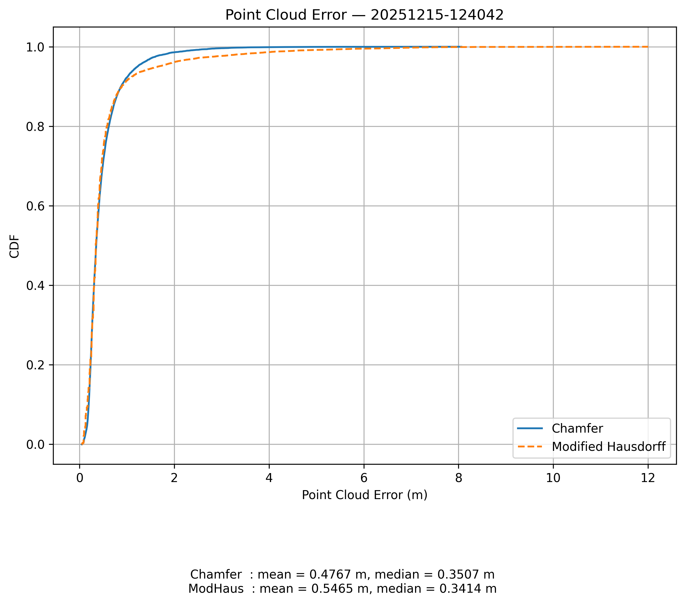
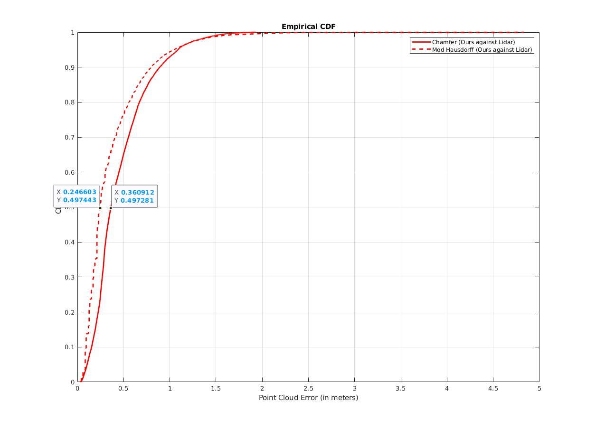

# Radar4K: Adapting RadarHD to the SLAM-RF Dataset

> **Repository status**
>
> This is a personal, private archival repository for a group project developed
> at EPFL. It contains code and documentation created by the student group,
> adaptations of third-party research code, and references to restricted data.
> It is **not** a claim of exclusive authorship or ownership by the repository
> maintainer.
>
> The restricted SLAM-RF dataset is not licensed for general redistribution.
> A future public repository must exclude the complete dataset, restricted
> derivatives, sensitive outputs, private cluster paths, and any other material
> that has not been cleared for publication.

## Overview

RadarHD is an end-to-end deep-learning framework that generates high-resolution,
LiDAR-like spatial representations from low-resolution mmWave radar data.

This repository contains an adaptation and extension of the RadarHD pipeline for
the **SLAM-RF** dataset. The project focuses on:

- synchronizing radar and LiDAR recordings;
- generating paired radar–LiDAR training samples;
- adapting data loading and network configurations to the new dataset;
- training, testing, cross-validation, and grid-search workflows;
- converting network outputs into Cartesian images and point clouds;
- evaluating the reconstructed point clouds;
- orchestrating computationally expensive experiments on the EPFL RCP cluster.

## Visual overview

<p align="center">
  
</p>

<p align="center">
  <em>
    Conceptual overview reproduced from the original RadarHD research
    materials. Credit: Prabhakara et al. The exact upstream source and reuse
    status must be confirmed before a public release.
  </em>
</p>

## Academic context and authorship

This project was developed as part of **CS-433 Machine Learning at EPFL** by:

- M. Atwi
- S. Bernasconi
- A. Dell'Orto

The work was supervised and supported by the **EPFL Laboratory of Sensing and
Networking Systems (SENS Lab)**, which provided access to the proprietary
SLAM-RF dataset used in the experiments.

The three students remain the authors of their joint project contributions.
This personal repository is maintained by S. Bernasconi for private archival,
research, and portfolio purposes and must not be interpreted as assigning
exclusive authorship of the group work to a single contributor.

## Upstream research and code

This project builds upon the RadarHD model and public research implementation:

- **Paper:** *High Resolution Point Clouds from mmWave Radar*
- **Authors:** Akarsh Prabhakara, Tao Jin, Arnav Das, Gantavya Bhatt,
  Lilly Kumari, Elahe Soltanaghai, Jeff Bilmes, Swarun Kumar, and Anthony Rowe
- **Venue:** IEEE International Conference on Robotics and Automation (ICRA), 2023
- **DOI:** `10.1109/ICRA48891.2023.10161429`
- **Upstream repository:** `akarsh-prabhakara/RadarHD`

The original architecture, training/evaluation structure, and several utility
modules in this repository originate from or are adapted from RadarHD. The
student group extended that foundation for the SLAM-RF data format, preprocessing
pipeline, dataset splitting, model experiments, cross-validation, cluster
execution, and additional evaluation workflows.

See:

- [`ATTRIBUTION.md`](./ATTRIBUTION.md)
- [`THIRD_PARTY_NOTICES.md`](./THIRD_PARTY_NOTICES.md)
- [`DATA_ACCESS.md`](./DATA_ACCESS.md)

## Results snapshot

The following CDF was generated by the student group from the evaluation of the
adapted model on the SLAM-RF test data.

<p align="center">
  
</p>

<p align="center">
  <em>
    SLAM-RF results produced by the student group. Because the figure is derived
    from restricted data, its inclusion in a future public repository requires
    confirmation from the SENS Lab.
  </em>
</p>

For context, the following figure records the reference CDF associated with the
original RadarHD researchers:

<p align="center">
  
</p>

<p align="center">
  <em>
    Reference image attributed to the original RadarHD researchers. Confirm the
    exact source and applicable reuse terms before publishing it.
  </em>
</p>

## Data policy

The full SLAM-RF dataset and its complete derived datasets must remain outside
Git history unless a separate written authorization explicitly permits their
distribution.

The local working copy may keep the full authorized data at:

```text
create_dataset/RadarHD-dataset-1/
├── lidar_pcl/
└── radar/
```

The private repository may instead
contain one **small, explicitly authorized, structurally representative sample**
for each modality. These samples are intended only to document file structure
and implementation choices; they are not sufficient to reproduce training.

## Repository structure

```text
.
├── README.md
├── ATTRIBUTION.md
├── THIRD_PARTY_NOTICES.md
├── DATA_ACCESS.md
├── Dockerfile
├── .gitignore
│
├── train_slam.py
├── test_slam.py
├── cross_val.py
├── cross_val_single.py
├── inspect_file.py
├── pcd_visualize.py
│
├── train_test_utils/
│   ├── README.md
│   ├── dataloader.py
│   ├── dataloader_slam.py
│   ├── dice_score.py
│   ├── model.py
│   └── unet_parts.py
│
├── create_dataset/
│   ├── README.md
│   ├── sync_slam_rf.py
│   ├── TestImagefromarray.py
│   ├── train_test_split.py
│   ├── train_test_split_byDays.py
│   └── RadarHD-dataset-1/
│
├── eval/
│   └── README.md
│
├── cluster/
│   └── README.md
│
├── docs/
├── images/
└── archive/
```

## Environment setup

### Prerequisites

- Git
- Docker
- sufficient local storage for the authorized dataset and generated outputs
- access to a CUDA-capable environment for GPU execution, or a CPU-compatible
  configuration for smaller tests

### Build the Docker image

From the repository root:

```bash
docker build -t radar4k .
```

### Start an interactive container

Linux, macOS, or WSL:

```bash
docker run --rm -it \
  --shm-size=8g \
  -v "$(pwd)":/workspace/radar4k \
  -w /workspace/radar4k \
  radar4k
```

For GPU execution, add the Docker GPU option supported by the host system:

```bash
docker run --rm -it \
  --gpus all \
  --shm-size=8g \
  -v "$(pwd)":/workspace/radar4k \
  -w /workspace/radar4k \
  radar4k
```

All commands in the following sections are intended to be run from the
repository root inside the container unless stated otherwise.

## Workflow

### 1. Inspect or prepare the raw data

The raw authorized data are expected under:

```text
create_dataset/RadarHD-dataset-1/
├── lidar_pcl/
└── radar/
```

To inspect the structure of a stored object or array, use the relevant helper:

```bash
python3 inspect_file.py
```

or:

```bash
python3 create_dataset/TestImagefromarray.py
```


### 2. Synchronize and preprocess radar and LiDAR data

Run:

```bash
python3 create_dataset/sync_slam_rf.py
```

This script performs the SLAM-RF-specific synchronization and preprocessing
required to generate paired radar and LiDAR samples. 

Detailed notes are provided in
[`create_dataset/README.md`](./create_dataset/README.md).

### 3. Create train/test splits

For a standard split:

```bash
python3 create_dataset/train_test_split.py
```

For a split grouped by acquisition day:

```bash
python3 create_dataset/train_test_split_byDays.py
```

The day-based split should be preferred when leakage between temporally related
recordings would otherwise be possible.

### 4. Train a model

```bash
python3 train_slam.py
```

Training outputs are normally written to a run-specific directory under
`logs/`. Large checkpoints should not be committed with ordinary Git.

### 5. Run cross-validation or grid search

Full cross-validation/grid-search workflow:

```bash
python3 cross_val.py
```

Single configuration or single-fold workflow:

```bash
python3 cross_val_single.py
```

### 6. Test a trained model

```bash
python3 test_slam.py
```

The testing script loads the selected checkpoint and produces predicted radar
representations together with the corresponding LiDAR ground truth for the test
set. Verify the checkpoint path, test dataset path, model variant, and device
before execution.

For CPU-only execution, ensure that the selected device is `cpu` and that the
script does not unconditionally call CUDA-specific operations.

### 7. Post-process and evaluate predictions

The evaluation pipeline can be run as a single workflow:

```bash
cd eval
python3 postprocess_slam.py
```

or step by step:

```bash
cd eval
python3 pol_to_cart_slam.py
python3 image_to_pcd_slam.py
python3 pc_compare.py
```

Point clouds may be visualized with the repository-level utility:

```bash
cd ..
python3 pcd_visualize.py
```

See [`eval/README.md`](./eval/README.md) for the expected intermediate outputs
and limitations.

### 8. Run cluster orchestration scripts

The scripts under `cluster/` were created for internal use by the student group
on the EPFL RCP cluster. They parallelize preprocessing, splitting, training,
testing, cross-validation, grid search, and post-processing jobs.

Typical entry points include:

```bash
bash cluster/automatic_run_preproc_split.sh
bash cluster/automatic_run_training_gs.sh
bash cluster/automatic_run_cross_validation_gs.sh
bash cluster/automatic_run_train_test_postproc.sh
```

The lower-level scripts may also be launched individually:

```bash
bash cluster/run_preproc_split.sh
bash cluster/run_split.sh
bash cluster/run_training_gs.sh
bash cluster/run_cross_validation_single.sh
```

Before using any cluster script, inspect and replace:

- EPFL usernames and group names;
- absolute filesystem paths;
- container image names;
- storage locations;
- scheduler directives;
- requested CPUs, GPUs, memory, and wall time;
- dataset, checkpoint, and output paths;
- environment modules and cluster-specific commands.

> **Cluster disclaimer**
>
> These shell scripts were developed for the software environment, scheduler,
> filesystem layout, storage locations, and computational resources available
> to the group on the EPFL RCP cluster. They are retained for transparency and
> archival purposes. The authors do not guarantee that they will run without
> modification on another system, or that they will reproduce the reported
> results without the original data, dependencies, environment, random seeds,
> hardware, and cluster configuration.

## Outputs and reproducibility

A fresh clone of this repository is not, by itself, sufficient to reproduce the
complete experiments. Full reproduction also requires:

- authorized access to the SLAM-RF dataset;
- the exact preprocessing and split configuration;
- matching package versions and container environment;
- access to suitable computational resources;

## Images and reports

The `images/` directory contains:

- figures from the original RadarHD work, included as a reference for comparison;
- the student group's original cumulative distribution function figure, generated from the results obtained on the SLAM-RF dataset;

The `docs/` directory contains:

- the official EPFL CS-433 Project 2 assignment;
- the final report written by the student group on the basis of the methods, experiments, and results produced in this project.

The figures and documents are included for documentation, attribution, and academic context. Their reuse may remain subject to the rights of the original RadarHD authors, EPFL course-distribution conditions, the joint authorship of the student group, and restrictions associated with the proprietary SLAM-RF dataset.

## Citation

When referring to the underlying RadarHD method, cite:

```bibtex
@inproceedings{prabhakara2023radarhd,
  author    = {Prabhakara, Akarsh and Jin, Tao and Das, Arnav and
               Bhatt, Gantavya and Kumari, Lilly and Soltanaghai, Elahe and
               Bilmes, Jeff and Kumar, Swarun and Rowe, Anthony},
  title     = {High Resolution Point Clouds from mmWave Radar},
  booktitle = {2023 IEEE International Conference on Robotics and Automation (ICRA)},
  year      = {2023},
  pages     = {4135--4142},
  doi       = {10.1109/ICRA48891.2023.10161429}
}
```

If this student adaptation is cited or described, credit all three student
authors and identify it as an EPFL CS-433 group project supervised by the SENS
Lab.

## Licensing and reuse

No license should be inferred for the complete contents of this repository.

The repository combines:

- joint student-authored work;
- source code derived or adapted from the RadarHD implementation;
- restricted data and data-derived materials;
- course and laboratory-related documentation.

The upstream RadarHD repository does not currently expose an explicit license
file in its repository root. Therefore, redistribution or relicensing of copied
or derivative source code must not be assumed to be permitted merely because
the source is publicly visible.

## Disclaimer

This repository is provided for private archival and research purposes. No
warranty is made regarding correctness, fitness for a particular purpose,
reproducibility, or portability to systems other than those used during the
project.
